# TACHO LIBRE
https://thawing-depths-15975.herokuapp.com/

### The One Stop for All Who :heart: Tacos - Nachos - and :beers:

The web app is built to be used by Admins of the TACHO LIBRE restaurant, as well as the Chefs and Servers that run the show.

Each user has a specified role and is able to do certain things that pertain to those roles.

Servers have access to the tables that they monitor. They will be able to add or remove guests from a specific table. The server is then able to select the items from the guest that they are ordering and they get added to the bill.

Then the order is sent to the kitchen, where the chef has to start cooking. A list of items recently ordered shows up on the screen. As the chef processes the orders, they can click and the order will be sent to the server so they can pick it up and deliver it to the guest. The same interface happens for the bartenders and the drinks they must make.

After the chef finishes and processes an order, the server will be able to see that the order had been processed and it was waiting for them to bring to the table.

The Admin is able to add or remove Employees from the business and they can do so in the middle of the evening of work! They are also able to change the menu items that are offered and remove them if they wish..

## ERD's

## Wireframes
#### Frame 1
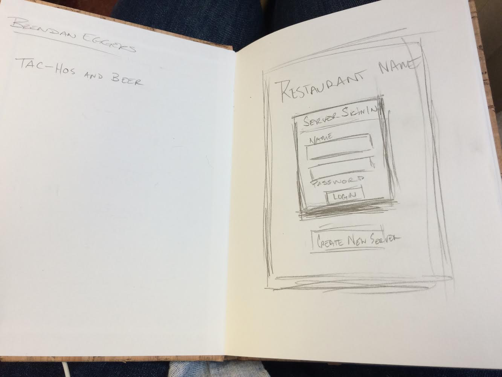

#### Frame 2
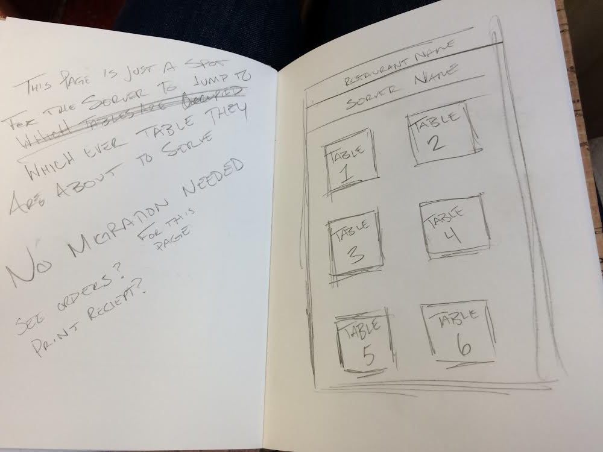

#### Frame 3
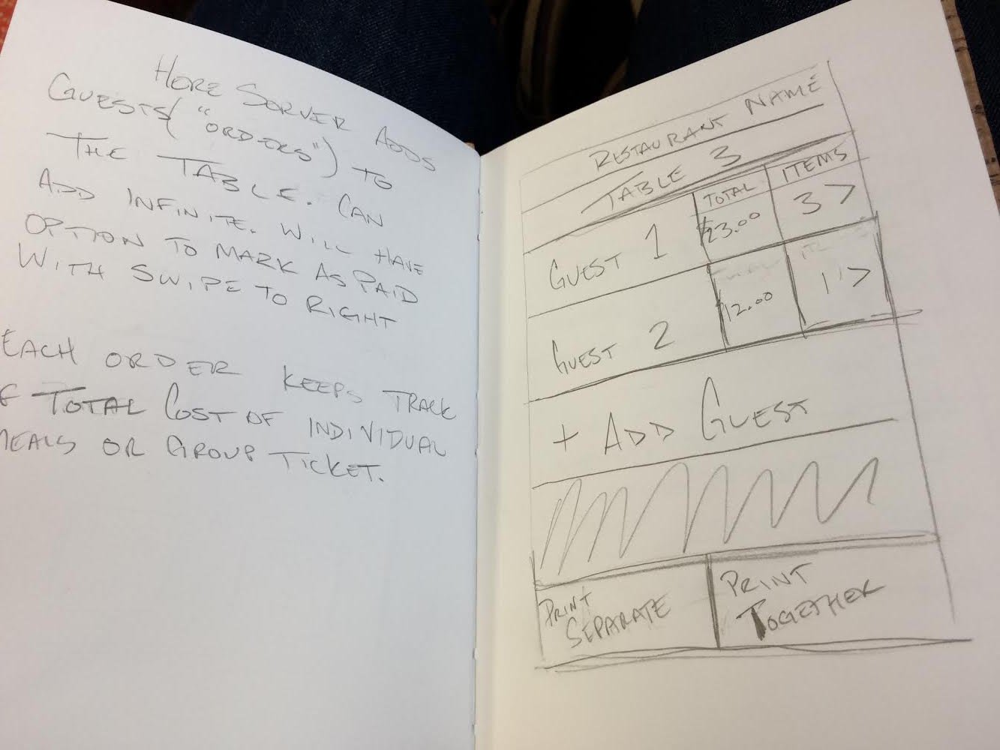

#### Frame 4
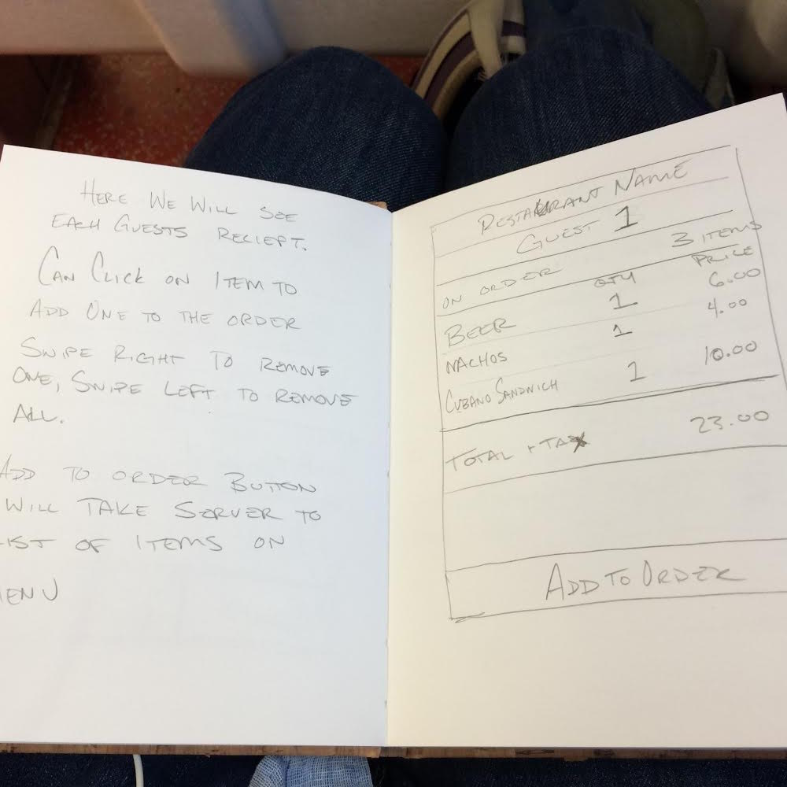

#### Frame 5
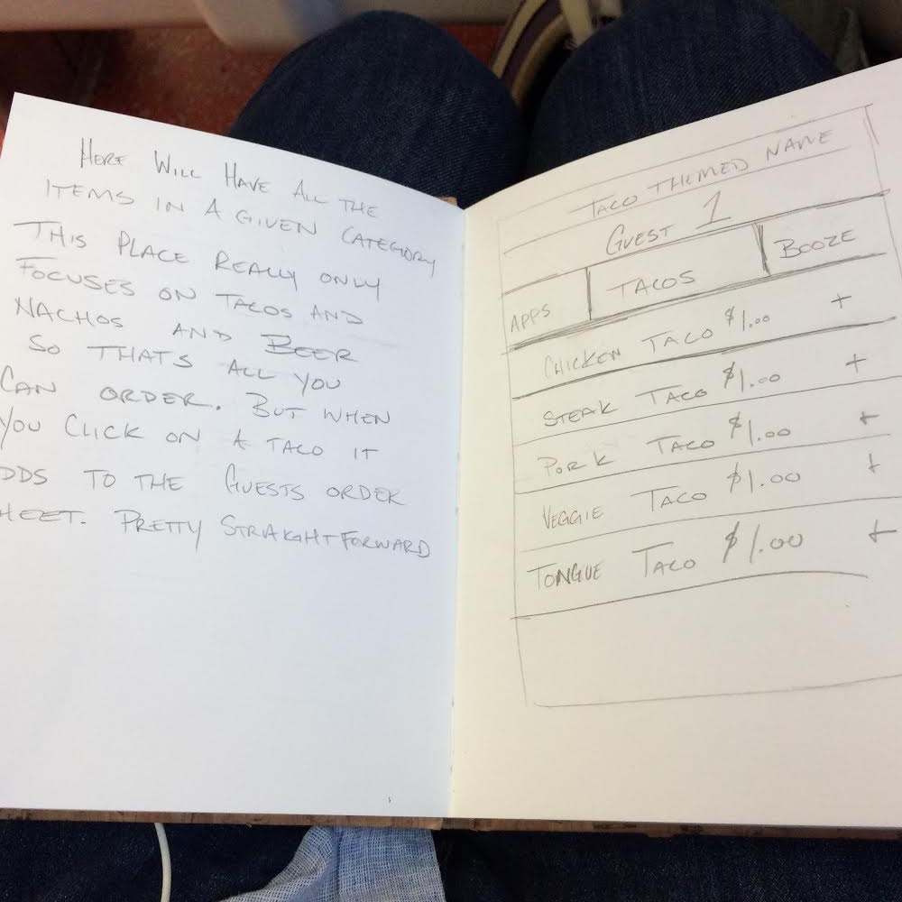

## Screenshots
#### Login
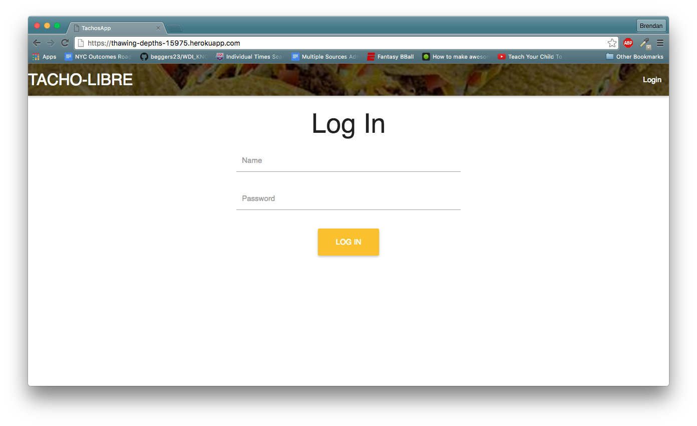
#### Admin
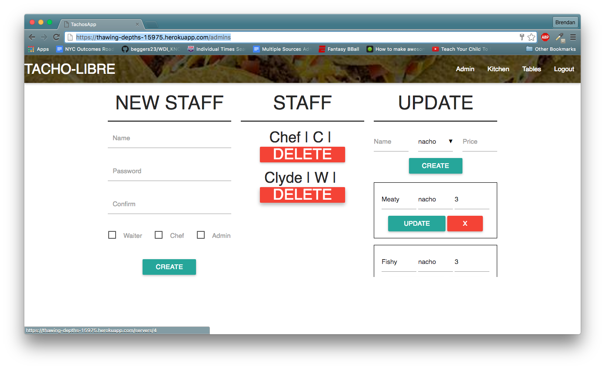
#### Kitchen
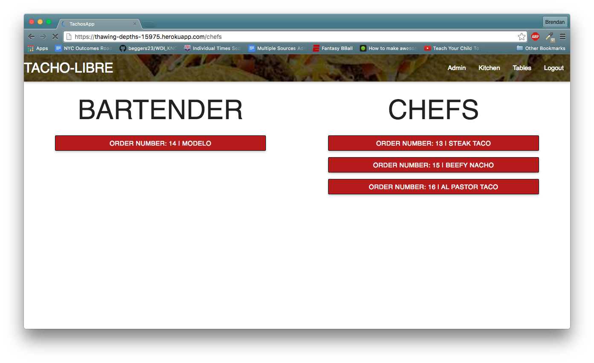

#### Server
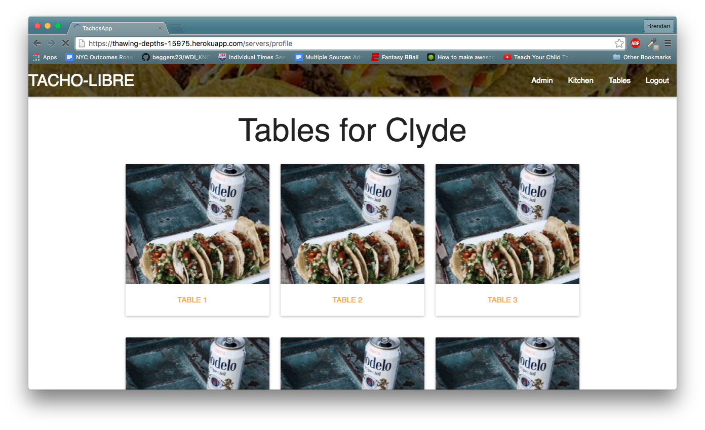

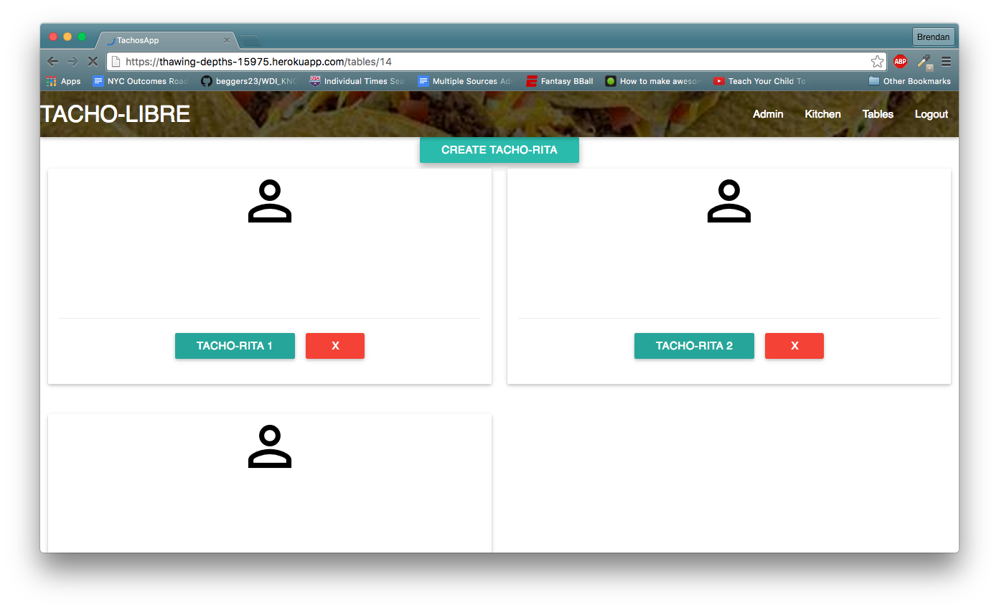

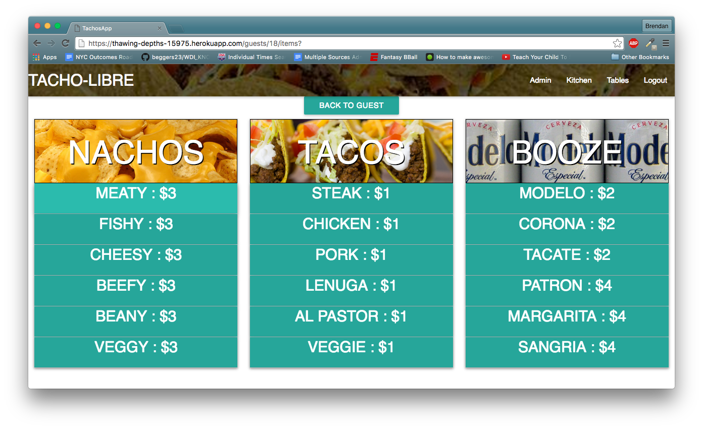

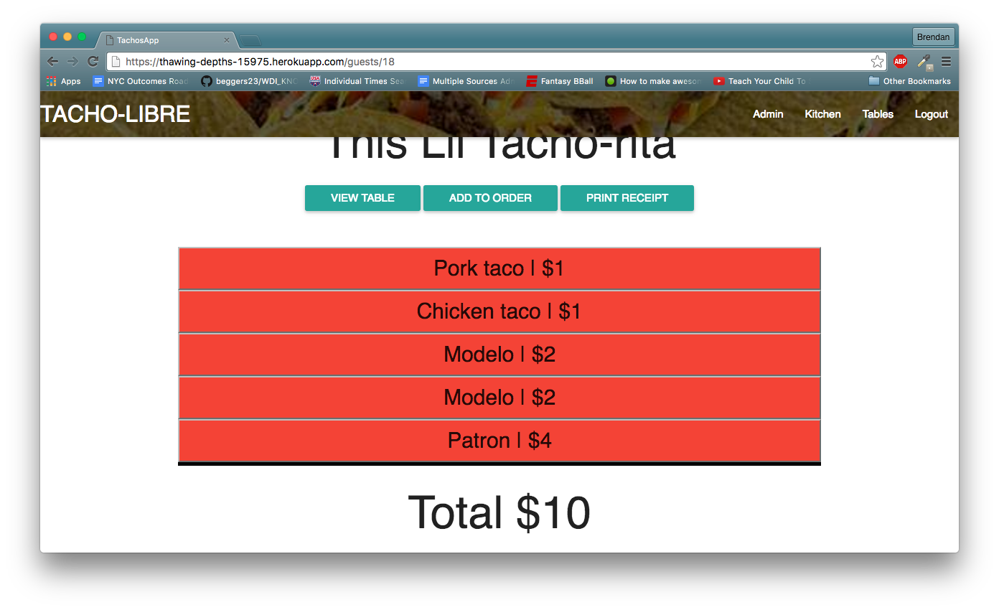

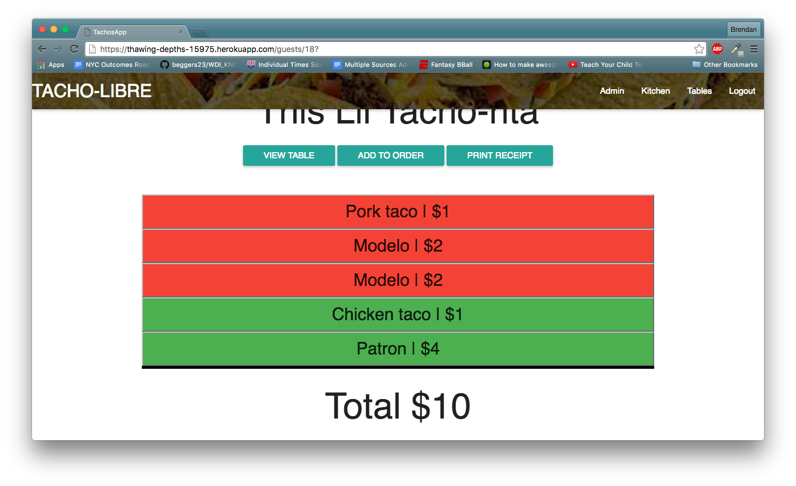
